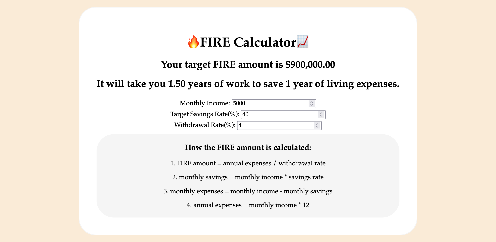

# FIRE Calculator

A simple financial calculator based off the FIRE(Financial Independence, Retire Early) movement built with React, JavaScript and CSS.

# Installation and Setup 

Clone down this repository. You will need `node` and `npm` installed globally on your machine.

Installation:

`npm install`

To Run Test Suite:

`npm test`

To Start Server:

`npm start`

To Visit App:

`localhost:3000`

# Reflection
I wanted to learn basic React Hooks and a calculator seemed like a good starting point. I decided to create a financial calculator since the FIRE movement has been gaining more traction recently. It was challenging in the beginning as I had minimal experience with React but by the end of the project, I have a better understanding of the useState and useEffect Hooks. 

One of the challenges I ran into was the user inputs dissapears everytime the page refreshes. I researched and found out it was because I had to persist the state in order for the data to be kept on refresh. I chose to use LocalStorage for my project as it was a relatively simple and straightforward method.

# Credits
+ Formulas used for calculations were referenced from [Seedly](https://blog.seedly.sg/fire-financial-independence-retire-early-in-singapore/).

